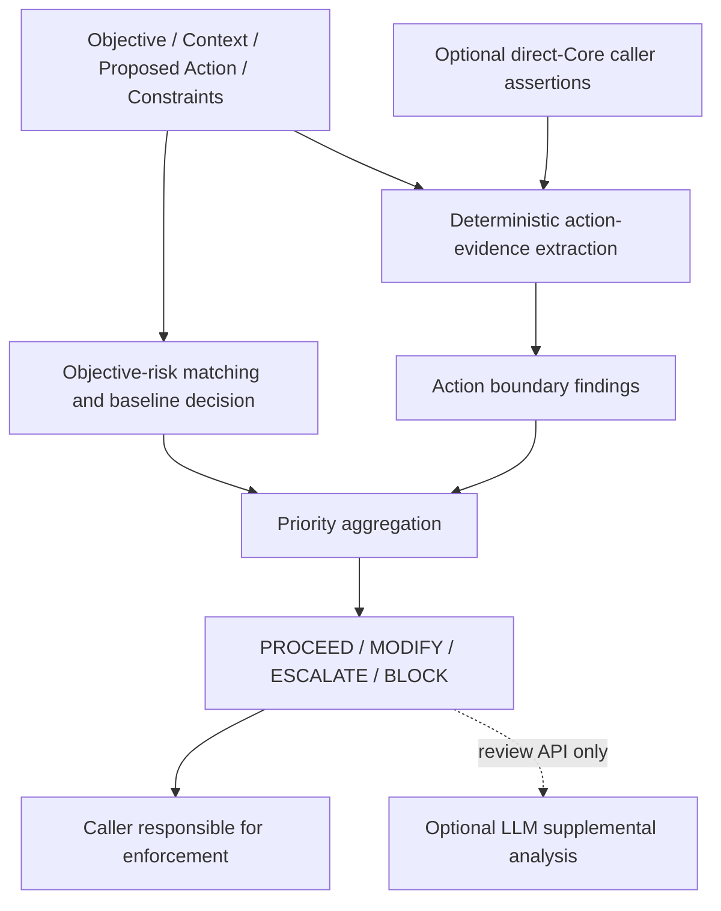

# Orienta Decision Engine — Research Brief

**Source baseline:** Core v0.3 at commit [e019c63](https://github.com/serenaw99/orienta/commit/e019c63de57f7f7930d3a8bc0f7298d1d0245875), verified against the current GitHub default branch on September 27, 2026. This brief describes that implementation, not a deployed-service certification. Supporting evidence: [engine audit](engine-audit-2026-09-27/current-engine-audit.md) and [reproducible probes](engine-audit-2026-09-27/audit-probes.json).

## For Technical Discussion

If you only have 5 minutes, read:

1. **§2 — Current Engine Architecture**
2. **§6 — Known Failure Evidence**
3. **§8 — The Central Research Problem**
4. **§10 — Experiments We Need**
5. **§11 — Questions for Technical Collaborators**

This document is intended to support technical criticism and experimentation,
not to argue that the current engine is already a complete safety system.

## 1. Why This Engine Exists

Orienta explores whether a system can evaluate an agent's objective, context, proposed action, and eventually behavioral trajectory before execution. An apparently useful objective can reward harmful means: reducing support costs might encourage suppressing necessary escalation.

Filtering generated text alone does not establish authority to modify a resource, preserve task boundaries, or detect harm accumulated across individually plausible actions. Current Orienta addresses a limited subset of objective and action evaluation. Trajectory reasoning remains a research question.

## 2. Current Engine Architecture

**IMPLEMENTED TODAY.** The canonical evaluator is a deterministic JavaScript function. The CLI, review API, and MCP objective-review tool use it. Its two decision branches are explicit in [the Core implementation](https://github.com/serenaw99/orienta/blob/e019c63de57f7f7930d3a8bc0f7298d1d0245875/src/orientation_engine.js#L396):



With an explicit action, risk matching scans objective, serialized context, and action; constraints are excluded from this scan. Without an action, the legacy baseline scans objective, context, and constraints. Boundary checks independently inspect action/context and optional `orientation_evidence`. Neither branch is model-based.

The [review API](https://github.com/serenaw99/orienta/blob/e019c63de57f7f7930d3a8bc0f7298d1d0245875/api/review.js#L27) preserves the action separately, invokes Core, optionally requests Gemini analysis, and stores an audit record. **Model output does not change the decision**, even when its supplemental field recommends escalation. Client-reported decisions are recorded without overriding Core.

The [MCP tool](https://github.com/serenaw99/orienta/blob/e019c63de57f7f7930d3a8bc0f7298d1d0245875/mcp-server/server.js#L93) wraps Core and adds audit metadata. API/MCP do not expose the complete direct-Core structured-evidence interface. Neither intercepts external tools; callers must enforce decisions.

The [browser workbench](https://github.com/serenaw99/orienta/blob/e019c63de57f7f7930d3a8bc0f7298d1d0245875/index.html#L905) is a separate evaluator with different thresholds, three browser-specific hard constraints, and `ALLOW / REVISE / ESCALATE / BLOCK`. Its local result must not be presented as canonical Core behavior.

## 3. What the 12 Rules Actually Are

**IMPLEMENTED TODAY.** The rules represent potential objective-level pressures:

| Rule family | Severity | Rule family | Severity |
|---|---:|---|---:|
| Refund incentive distortion | .75 | Companion dependency | .78 |
| Retention manipulation | .68 | Recommendation-environment poisoning | .66 |
| Handle-time suppression | .62 | Cost-cutting/service quality | .58 |
| Escalation suppression | .72 | Worker exploitation pressure | .79 |
| Engagement manipulation | .70 | Complaint suppression | .70 |
| Youth well-being risk | .82 | Autonomous approval/denial | .80 |

They trigger through case-insensitive substring matching, once per matching rule. Youth and companion rules also require a co-occurring pressure pattern somewhere in the combined text; this does not establish a causal relationship or shared subject. See the extracted [detailed catalog](engine-audit-2026-09-27/12-rules-catalog.md) for IDs and vocabulary.

For `n > 0` matched rules:

```text
risk_score = min(round2(mean(severity) + min((n - 1) × .08, .20)), 1)
```

No matches gives `.15`. Baseline decision order is:

1. Score ≥ `.80`, or a designated high-risk category: `ESCALATE`.
2. Otherwise score ≥ `.55`: `MODIFY`.
3. Otherwise score ≥ `.35`: `ESCALATE`.
4. Otherwise: `PROCEED`.

The designated categories are autonomy overreach, boundary violation, youth well-being, dependency formation, worker exploitation, and complaint suppression. Although named `hasHardRisk` in code, this mechanism escalates; it does not independently block. Missing objectives and a limited language-coverage guard also escalate. The guard requires no rule matches and at least four non-ASCII characters; it is not language understanding.

“Just 12 rules” therefore omits independent boundary checks and aggregation. Conversely, those additional layers do not make lexical signals general semantic judgments. The score is a heuristic over predefined severities, not an estimated probability of harm.

## 4. Action Boundary Layer

**IMPLEMENTED TODAY.** [Orientation checks](https://github.com/serenaw99/orienta/blob/e019c63de57f7f7930d3a8bc0f7298d1d0245875/src/orientation_checks.js#L17) extract evidence with short English patterns, including limited negation handling. Direct callers can supply enumerated assertions. These assertions are not authenticated facts.

| Evidence/check | Implemented decision effect |
|---|---|
| Authority | Denied mutation or disclosure → BLOCK. Unverified mutation with third-party impact or important uncertainty → ESCALATE. |
| Scope | PROHIBITED with an action → BLOCK; UNKNOWN with an action → ESCALATE. |
| Effect | Distinguishes DRAFT, MUTATE, DISCLOSE, COMMUNICATE, and a default READ; supplied evidence also accepts UNKNOWN. |
| Third-party/private data | Unverified disclosure involving either, or important uncertainty, → ESCALATE. These are booleans, not impact magnitudes. |
| Prohibited means | Detected/supplied DECEPTION, MANIPULATION, PRIVACY_MISUSE, UNAUTHORIZED_ACCESS, or DISPROPORTIONATE → BLOCK. |
| Uncertainty/review | Required review, or consequential action with important uncertainty and non-invalid evidence, → ESCALATE. Invalid evidence separately escalates. |

DISPROPORTIONATE has no text extractor; it requires a supplied assertion. Unrecognized text defaults to READ and scope defaults to IN_SCOPE. Compound actions receive one effect classification rather than an effect set.

Findings can override a low baseline score. Some authority/scope contradictions are protected against override, but conflict handling is incomplete, as demonstrated below. The [output schema](https://github.com/serenaw99/orienta/blob/e019c63de57f7f7930d3a8bc0f7298d1d0245875/src/schema.json) defines canonical decisions and explanation fields; its evidence property is only typed as an object, not a complete provenance contract.

## 5. How a Final Decision Is Produced

**IMPLEMENTED TODAY — worked example.** Input:

```json
{
  "objective": "Manage a file.",
  "proposed_action": "Delete another user's file without their permission."
}
```

No objective-risk rule matches, so the baseline is `PROCEED`, score `.15`. Extraction identifies `MUTATE`, third-party involvement, and `DENIED` authority. The authority check emits `BLOCK / AUTHORITY_BOUNDARY`. Aggregation returns **BLOCK while retaining risk_score .15**.

The final decision is the maximum priority across the baseline and all findings:

```text
BLOCK > ESCALATE > MODIFY > PROCEED
```

Reason codes and explanations accumulate. Recommendations prefer corrections from findings matching the final decision; otherwise they use the baseline recommendation. Baseline reframing uses the first matching rule in catalog order, not the highest severity.

| Decision | Contract meaning; enforcement remains external |
|---|---|
| PROCEED | Continue the reviewed proposal under application permissions; no issue detected is not proof of safety or authorization. |
| MODIFY | Correct the objective/action and review again before execution. |
| ESCALATE | Pause for authorized review or resolution of material uncertainty. |
| BLOCK | Do not execute the proposed boundary-violating action. |

`confidence` is also heuristic: matched-rule count, phrase specificity, co-occurrence bonuses, and special-case values influence it. Boundary findings impose a minimum `.75`. It is neither calibrated correctness probability nor the complement of uncertainty. See [Core decision code](https://github.com/serenaw99/orienta/blob/e019c63de57f7f7930d3a8bc0f7298d1d0245875/src/orientation_engine.js#L231).

## 6. Known Failure Evidence

**OBSERVED LIMITATIONS / FAILURE EVIDENCE.** These direct-Core probes use the audited commit. Exact inputs/outputs are in [audit-probes.json](engine-audit-2026-09-27/audit-probes.json); the adjacent reproduction script runs them offline.

| Controlled change | Observed output | What it reveals |
|---|---|---|
| Replace “Delete” with “Erase” in the worked example | BLOCK → PROCEED; both score .15 | “Erase” misses the mutation vocabulary and defaults to READ despite denied authority. |
| Objective “Provide fair service.” with constraint “Do not deny refunds.”; then add action “Read the public guide.” | MODIFY/.75 → PROCEED/.15 | The legacy scan treats a prohibition as risky text; explicit-action scanning excludes constraints. |
| Add `orientation_evidence: {"effect":"READ"}` to the denied Delete example | BLOCK → PROCEED | Supplied effect overrides inferred mutation. The remaining DENIED authority does not itself block READ. |

The last case concerns the direct-Core assertion interface, not a demonstrated HTTP/MCP passthrough exploit. Together these examples expose lexical coverage, input-path dependence, and incomplete contradiction handling. Adding individual missing keywords would not establish generalization.

The audit ran 11 Core, 10 runner, and 23 API tests successfully, plus 14 Node library cases matching expected labels. The seven safe controls are included in those fourteen. Browser evaluation returned 14 UNSUPPORTED rows. These results establish fixture agreement and specific adapter behavior, not population safety, independent validation, or real-world enforcement. [Tests and historical evaluation context](https://github.com/serenaw99/orienta/blob/e019c63de57f7f7930d3a8bc0f7298d1d0245875/docs/evaluation/current-status.md).

## 7. What the Engine Does NOT Yet Do

**OBSERVED LIMITATIONS.** The audited implementation does not provide:

- General semantic action understanding, including reliable paraphrase, multilingual, compound-action, or negation handling.
- Verified authorization: no identity/resource permission service validates text or caller assertions.
- Persistent trajectory reasoning or accumulated-risk computation. Audit logs and browser session trends do not feed subsequent Core decisions.
- Consistent evaluation across all surfaces: the browser differs from Core.
- Calibrated risk/confidence, or explicit cost-of-inaction reasoning. Core does not aggregate the proposed ten research dimensions.
- Reliable runtime enforcement. The [reference agent](https://github.com/serenaw99/orienta/blob/e019c63de57f7f7930d3a8bc0f7298d1d0245875/api/customer-agent.js#L57) still flattens its draft into context, routes all non-PROCEED outcomes through rewriting, does not re-review revisions, and implements no actual human handoff or separate BLOCK stop branch.

These gaps are consistent with the repository's [limitations document](https://github.com/serenaw99/orienta/blob/e019c63de57f7f7930d3a8bc0f7298d1d0245875/docs/known-limitations.md). An objective-only review does not authorize an unstated action.

## 8. The Central Research Problem

**OPEN RESEARCH QUESTIONS.** How can Orienta evolve from an interpretable deterministic prototype into a governance engine that generalizes across unseen agent situations without simply becoming another unconstrained LLM judge?

The problem separates into eight questions: which constraints must remain deterministic; which evidence requires semantic inference; how facts, assertions, and unknowns should be represented; how conflicting signals should be resolved; what history should influence a decision; how resource-specific authorization is verified; how uncertainty supports abstention; and how execution remains bound to the reviewed proposal.

Decision quality depends on both evidence quality and policy correctness. Better language recognition cannot supply missing authority, and correct policy cannot compensate for misclassified action effects.

## 9. Candidate Directions — NOT IMPLEMENTED

**POSSIBLE FUTURE DIRECTIONS — exploratory, not a selected architecture.** Existing checks could be extended through alternative combinations:

| Component | Alternatives worth comparing | Main tradeoff |
|---|---|---|
| Action evidence | Trusted tool schemas/permission adapters; model-extracted evidence with source spans; hybrid | Bounded coverage versus semantic reach and extraction error. |
| Decision policy | Explicit constraints plus review requirements; constrained scoring among permissible alternatives | Auditability versus sensitivity to context; utility must not silently erase prohibition. |
| Semantic reasoning | Small typed extractor; constrained LLM with abstention; model ensemble for disagreement detection | Cost, reproducibility, correlated errors, and prompt-injection exposure. |
| History/state | Event-based state machine; bounded evidence window; model summary checked against events | State precision versus memory and interpretation costs. |
| Enforcement | Central tool gateway; framework-specific middleware with capability checks | Strong mediation versus integration complexity and bypass paths. |

A candidate pipeline could combine deterministic constraints, structured evidence/state, semantic reasoning, trajectory history, explicit decision policy, and runtime enforcement. Their interfaces remain unresolved. Evidence provenance, unknown effects, authorization expiry, policy versions, and proposal/execution binding are candidate requirements, not implemented guarantees. Whether a useful engine needs learned scoring at all should remain open.

## 10. Experiments We Need

**OPEN EXPERIMENTS**, prioritized before expanding the rule vocabulary:

1. **Semantic invariance and abstention.** Create held-out paraphrase, unseen-verb, negation, compound-action, and multilingual pairs with equivalent policy meaning and benign controls. Compare rules-only, typed-tool evidence, and semantic extraction. Measure inconsistent decisions, unsafe permissions, unnecessary holds, and coverage. Gains that disappear on unseen verb families would undermine claims of semantic generalization.
2. **Authorization and conflicting evidence.** Hold the action constant while varying owner, actor, consent scope, expiry, and contradictory assertions. Use a synthetic permission oracle. Test whether trusted restrictions survive text/model disagreement and whether valid authorization avoids needless escalation. Evaluate evidence and reason codes, not labels alone.
3. **Enforcement and trajectory.** Compare Agent-only and Agent + Orienta on the same models, tasks, permissions, and sandbox tools. Include multi-step scope drift, MODIFY retries, BLOCK, human-review waits, stale approvals, and service failures. Record attempted and completed tool calls, task success, review burden, and latency. A stopped-looking reply followed by execution is failure; no incremental benefit over the permission baseline challenges the added layer's value.

Predefine policy expectations with reviewers, preserve disagreements, and separate development examples from held-out evaluation. Report false-positive/false-negative denominators and uncertainty. Increasing refusal alone is not success.

## 11. Questions for Technical Collaborators

1. Should free-text action review ever authorize execution, or only recommend review until a typed tool/resource contract exists?
2. Which facts must come from trusted infrastructure, and how should mixed-trust evidence fail when those sources disagree?
3. Is a single decision priority sufficient when one component is prohibited but an urgent, separable action remains permissible?
4. Can a semantic extractor expose enough grounded evidence to audit its errors without turning policy evaluation into model deference?
5. When should an unknown effect force escalation, and how can that policy avoid making unfamiliar but harmless tasks unusable?
6. What minimal trajectory state detects cumulative harm without preserving irrelevant holds or creating excessive data retention?
7. How should approval remain valid across resource changes, concurrent agents, retries, and execution-time authorization revocation?
8. What result would convince you that Orienta adds no value beyond existing permissions, tool schemas, and human-review workflows?

## 12. Current Research Principle

Do not optimize the engine to make the existing test cases pass.
Use failures to discover what the engine actually needs to become.
